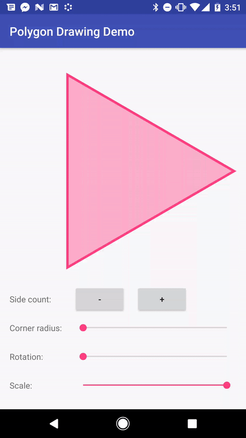

# PolygonDrawingUtil

 [  ](https://bintray.com/stkent/android-libraries/PolygonDrawingUtil/_latestVersion) [](https://android-arsenal.com/details/1/5597)

An efficient Android utility class for drawing regular polygons on a [`Canvas`](https://developer.android.com/reference/android/graphics/Canvas.html).

Consumers can specify:

- number of sides (≥ 3);
- center coordinates;
- outer radius (center to vertex);
- corner rounding radius;
- polygon rotation;
- fill/stroke [`Paint`](https://developer.android.com/reference/android/graphics/Paint.html).

# Demo



This video was captured using the sample application in this repository. It provides convenient controls for exploring `PolygonDrawingUtil`'s capabilities.

# Getting Started

1. Specify PolygonDrawingUtil as a dependency in your `build.gradle` file:

    ```groovy
    dependencies {
      compile 'com.stkent:polygondrawingutil:1.0.0'
    }
    ```

2. Create a new `PolygonDrawingUtil` instance and assign it to a field in your custom view class:

    ```java
    private PolygonDrawingUtil polygonDrawingUtil = new PolygonDrawingUtil();
    ```

3. Call `polygonDrawUtil.drawPolygon` in your `onDraw` method:

    ```java
    @Override
    protected void onDraw(Canvas canvas) {
      super.onDraw(canvas);

      polygonDrawingUtil.drawPolygon(
          canvas,
          numberOfSides,
          centerX,
          centerY,
          polygonRadius,
          cornerRadius,
          rotation,
          polygonPaint);
    }
    ```

# License

	Copyright 2017 Stuart Kent

	Licensed under the Apache License, Version 2.0 (the "License");
	you may not use this file except in compliance with the License.
	You may obtain a copy of the License at

	   http://www.apache.org/licenses/LICENSE-2.0

	Unless required by applicable law or agreed to in writing, software
	distributed under the License is distributed on an "AS IS" BASIS,
	WITHOUT WARRANTIES OR CONDITIONS OF ANY KIND, either express or implied.
	See the License for the specific language governing permissions and
	limitations under the License.
